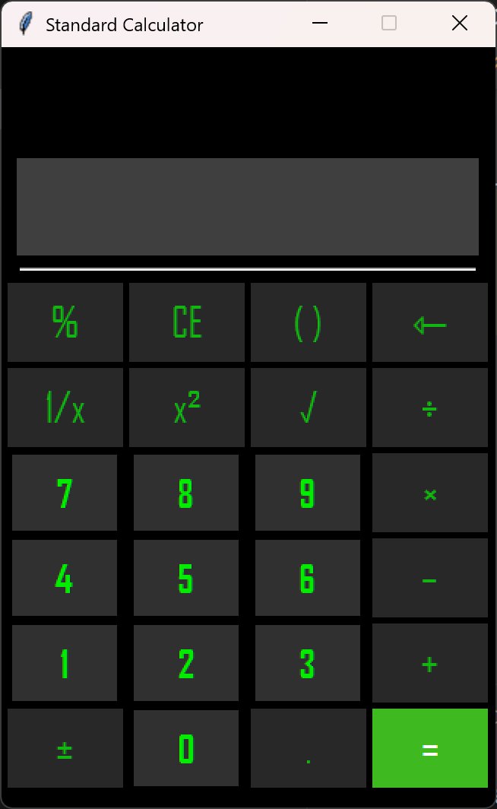

# 🧮 Standard Calculator (Tkinter GUI)

A simple yet fully functional **Standard Calculator** built using **Python** and **Tkinter**. This project replicates the basic operations of physical calculators, designed with a modern GUI and responsive controls.

---

## 🚀 Features

* Basic arithmetic operations: `+`, `−`, `×`, `÷`
* Advanced functions:

  * Percentage `%`
  * Square `x²`
  * Square Root `√`
  * Reciprocal `1/x`
* Input handling:

  * Bracket toggling: `(` / `)`
  * Backspace `⇽`
  * Toggle sign `±`
* Real-time display update
* Error handling for invalid expressions
* Modern, dark-themed UI with styled buttons

---

## 🖼️ Screenshot

---

## 🛠️ Technologies Used

* Python 3
* Tkinter (standard Python GUI library)
* ttk for UI elements (like separators)
* `math` module for square root and other math functions

---

## ✅ To Do / Future Improvements

* Add keyboard input support
* Add scientific calculator mode
* Implement memory buttons (M+, M-, MR, MC)
* Include history of calculations

---

## 🤝 Contributing

Contributions are welcome! Please feel free to fork the repository and submit a pull request.

---

## 📄 License

This project is open-source.

---
